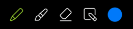
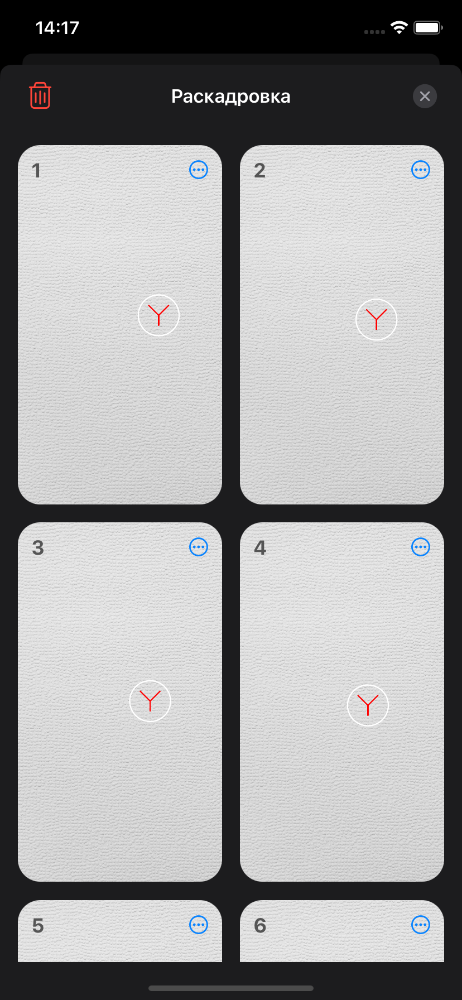
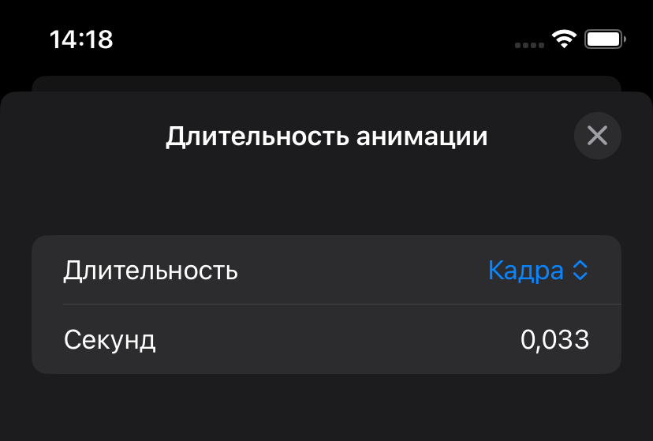

# Живые картинки (YaCup 2024)
## Предисловие
Прошу обратить внимание, что весь функционал сделан с вниманием к деталям, а не просто с целью выполнить задание и заработать баллы.  
  
Например, приложение генерирует осмысленную (но рандомную) анимацию, есть возможность указать длительность как для каждого кадра, так и для всей анимации в секундах, undo / redo работает глобально на все действия, для каждого инструмента рисования можно задавать свою ширину и тд.  
  
Иногда это создает дополнительные corner кейсы, которые надо обработать, тем не менее из всех этих мелочей и складывается UX.
## Инструкция пользователя
### Главный экран
По центру экрана располагается холст для рисования.

  
На верхней панели доступны кнопки (слева направо):
- отменить последнее действие;
- повторить отмененное действие;
- удалить текущий кадр;
- создать новый кадр (поверх текущего);
- открыть экран с раскадровкой;
- остановить воспроизведение анимации;
- запустить воспроизведение анимации.
 

  
На нижней панели доступны кнопки (слева направо):
- выбрать карандаш для рисования на холсте;
- выбрать маркер для рисования на холсте;
- выбрать ластик;
> При повторном нажатии на перечисленные выше кнопки показывается окно изменения толщины карандаша, маркера или ластика.
- создать (сгенерировать) произвольную анимацию;
- изменить цвет карандаша или маркера.
> При нажатии на изменение цвета открывается окно с подготовленными цветами. При этом пользователь в этом окне может нажать на палитру и перейти к отдельному окну детального выбора цвета.
 

  
Во время анимации на верхней панели доступны кнопки (слева направо):
- предупреждения (показывается при потере кадров из-за слишком высокой скорости анимации);
- поделиться;
- изменить длительности анимации (с помощью нее можно менять длительность (соответственно скорость) анимации);
- остановить воспроизведение анимации;
- запустить воспроизведение анимации.

### Экран раскадровки

На экране раскадровки показаны все кадры. При нажатии на кадр он выбирается текущим.
Здесь можно изменять последовательность кадров, удалить все кадры или дублировать и удалять отдельные кадры.

### Экран настройки длительности анимации

На этом экране настраивается длительность анимации. Можно указать как длительность всей анимации, так и длительность каждого кадра.

## Дополнительная функциональность
Из дополнительной функциональности реализовано:
- генерация и добавление N случайных кадров;
- экран с раскадровкой;
- кнопка дублирования кадра;
- возможность удаления сразу всех кадров;
- настройка скорости анимации;
- экспорт анимации в GIF;
- выбор кастомного цвета из RGB палитры;
- изменение толщины карандаща и ластика;
- стек действий для многократной отмены или возврата;
- иконка приложения;
- полноценная поддержка светлой и темной темы. 

## Технические детали
Приложение поддерживает iOS 16. При реализации сторонние библиотеки не использовались. Графика реализована с помощью Core Graphics.
